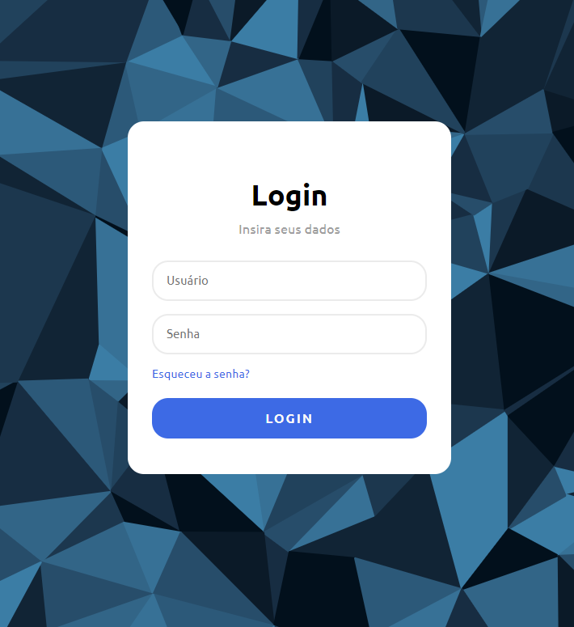

<h1 align="center"> Simple Login Page 👨‍💻</h1>

Simple Login Page

  <a href="#-technologies">Technologies</a>&nbsp;&nbsp;&nbsp;|&nbsp;&nbsp;&nbsp;
  <a href="#-project">Project</a>&nbsp;&nbsp;&nbsp;
  

 

  

## 🚀 Technologies

This project was developed with the following technologies:

- HTML
- CSS
- Github
- Figma

## 💻 Project

This page was developed as an exercise for Land 8 on the Rocketseat platform.

- [Access the finished project, online](https://viniciuszmota.github.io/Modernloginpage)

---